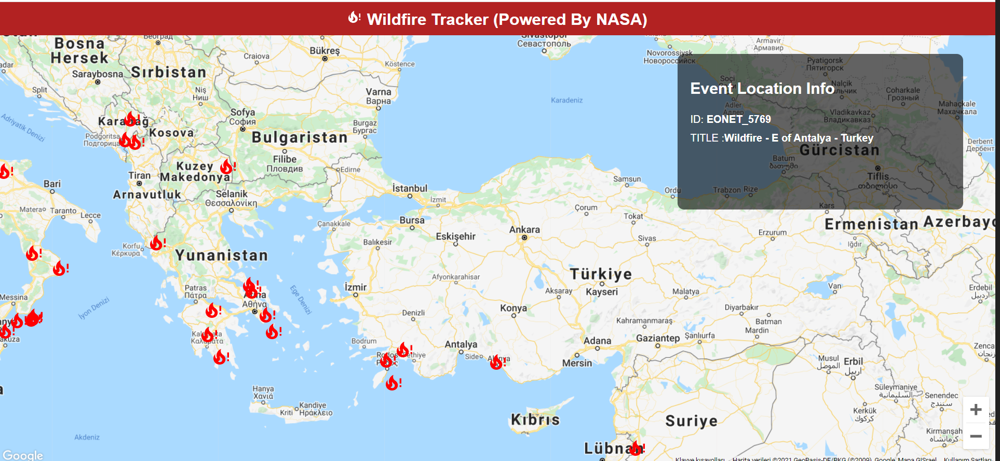

# WILDFIRE TRACKER

In this project i build wildfire tracker app with react.I use [NASA Open API] ,and [Google Maps API]

## HOW IT WORKS

```bash
git clone https://github.com/muratcansahn/wildfire-tracker

npm install

You must paste your api key  from google into map.js, GoogleMapReact component.


```

**### PACKAGES I USED**

Iconify

Google Maps React

[nasa open api]: https://eonet.gsfc.nasa.gov/docs/v2.1
[google maps api]: https://developers.google.com/maps
[ss]: https://slack-files.com/T029R2HM4AZ-F02R1EFEPKN-c1731c7fc1


